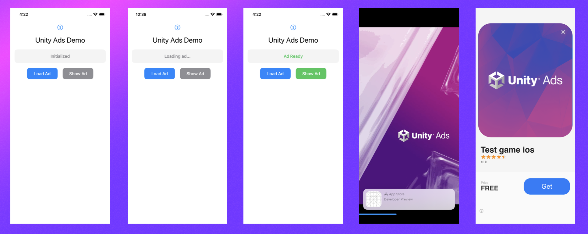

# UnityAds SDK Integration - iOS Demo App

This project demonstrates how to integrate Unity Ads SDK into an iOS SwiftUI application.
<p align="Left">
  
</p>
## Requirements

- **iOS**: 15.0+
- **Xcode**: 15.0+
- **CocoaPods**: Latest version
- **Unity Ads SDK**: 4.16.6 (installed via CocoaPods)

## Project Structure

```
iOSUnityAd/
├── Podfile                          # CocoaPods dependencies
├── iOSUnityAd.xcworkspace          # Xcode workspace (use this!)
├── iOSUnityAd/
│   ├── iOSUnityAdApp.swift          # App entry point
│   ├── ContentView.swift            # Main UI with ad buttons
│   └── UnityAdsManager.swift        # Unity Ads manager class
└── Pods/                            # UnityAds SDK (installed)
```

## Installation

### 1. Install Dependencies

```bash
cd iOSUnityAd
pod install
```

### 2. Open the Workspace

**Important**: Always open `.xcworkspace` instead of `.xcodeproj`

```bash
open iOSUnityAd.xcworkspace
```

### 3. Build and Run

Select a simulator (e.g., iPhone 17 Pro) and press `Cmd+R` to run.

## UnityAds API Reference

### Initialization

```swift
// Initialize Unity Ads (test mode)
UnityAds.initialize(gameId: "1487511", testMode: true, initializationDelegate: self)
```

### Loading Interstitial Ads

```swift
// Load an ad for a placement
UnityAds.load(placementId: "video", loadDelegate: self)
```

### Showing Ads

```swift
// Show ad with a view controller
UnityAds.show(viewController: self, placementId: "video", showDelegate: self)
```

### Banner Ads

```swift
// Create banner
let banner = UADSBannerView(placementId: "banner", size: CGSize(width: 320, height: 50))
banner.load()

// Add to view
view.addSubview(banner)
```

## UnityAdsManager Class

The `UnityAdsManager.swift` class provides a complete wrapper around Unity Ads functionality:

### Features

- Automatic SDK initialization
- Interstitial ad loading and showing
- Delegate callbacks for all ad states
- Observable properties for SwiftUI binding

### Usage

```swift
@StateObject private var adsManager = UnityAdsManager()

// Initialize on appear
.onAppear {
    adsManager.initialize()
}

// Load ad
adsManager.loadAd()

// Show ad (when ready)
adsManager.showAd()
```

## Configuration

### Game ID

The demo uses Unity's test Game ID: `3003911`

For production, replace with your own Game ID from [Unity Ads Dashboard](https://dashboard.unity3d.com/)

### Placement ID

The demo uses placement ID: `video`

Create your own placements in the Unity Ads dashboard.

## Delegate Protocols

### UnityAdsInitializationDelegate

```swift
func initializationComplete()
func initializationFailed(_ error: UnityAdsInitializationError, withMessage message: String)
```

### UnityAdsLoadDelegate

```swift
func unityAdsAdLoaded(_ placementId: String)
func unityAdsAdFailedToLoad(_ placementId: String, withError error: UnityAdsLoadError, withMessage message: String)
```

### UnityAdsShowDelegate

```swift
func unityAdsShowStart(_ placementId: String)
func unityAdsShowClick(_ placementId: String)
func unityAdsShowComplete(_ placementId: String, withFinishState state: UnityAdsShowCompletionState)
func unityAdsShowFailed(_ placementId: String, withError error: UnityAdsShowError, withMessage message: String)
```

## Error Types

- `UnityAdsInitializationError`:
  - `kUnityInitializationErrorInternalError`
  - `kUnityInitializationErrorInvalidArgument`
  - `kUnityInitializationErrorAdBlockerDetected`

- `UnityAdsLoadError`:
  - `kUnityLoadErrorInternalError`
  - `kUnityLoadErrorInvalidArgument`
  - `kUnityLoadErrorNoFill`
  - `kUnityLoadErrorNoConnection`

- `UnityAdsShowError`:
  - `kUnityShowErrorNotInitialized`
  - `kUnityShowErrorNotReady`
  - `kUnityShowErrorVideoPlayerError`
  - `kUnityShowErrorInvalidArgument`
  - `kUnityShowErrorNoConnection`
  - `kUnityShowErrorAlreadyShowing`
  - `kUnityShowErrorInternalError`

- `UnityAdsShowCompletionState`:
  - `.completed` - User watched the entire ad
  - `.skipped` - User skipped the ad

## Building from Command Line

Due to sandbox restrictions, use:

```bash
xcodebuild -workspace iOSUnityAd.xcworkspace \
  -scheme iOSUnityAd \
  -configuration Debug \
  -destination 'generic/platform=iOS Simulator' \
  ENABLE_USER_SCRIPT_SANDBOXING=NO \
  build
```

## Testing

1. **Test Ads**: Unity provides test ads automatically in test mode
2. **Test Mode**: Set `testMode: true` during initialization
3. **Debug Mode**: Enable debug mode for verbose logging:
   ```swift
   UnityAds.setDebugMode(true)
   ```

## Notes

- Unity Ads requires a valid Apple Developer account for real ads
- Test ads work in simulator without special configuration
- For App Store release, ensure you have valid provisioning profiles
- The SDK automatically handles ad caching and refresh

## Resources

- [Unity Ads Documentation](https://docs.unity3d.com/Manual/unity-ads.html)
- [Unity Ads Dashboard](https://dashboard.unity3d.com/)
- [Unity Ads FAQ](https://unityads.unity3d.com/help/common/faq)

## License

This is a demo project for educational purposes.

